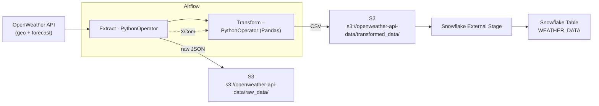

# Weather → S3 → Snowflake (Airflow + Docker)

A small, production-flavored pipeline that fetches **OpenWeather** data for a city (default **Vilnius**), stores **raw JSON** and **clean CSV** in **S3**, then loads it into **Snowflake** via an external stage — all orchestrated by **Apache Airflow**.

> Status: **WIP** — iterating as I learn and expand the pipeline.

---

## What this demonstrates

- **Airflow 2.9** DAG design: TaskGroups, PythonOperator, retries, daily schedule
- **AWS S3** as raw/clean data layers
- **Snowflake** load with `COPY INTO` from an external stage
- **Docker Compose** stack for local development (webserver, scheduler, Postgres metadata)

---

## Architecture

**File naming** (per run):  
- Raw: `raw_data/{{ data_interval_start | ds }}Vilnius.json`  
- Clean: `transformed_data/{{ data_interval_start | ds }}_Vilnius.csv`

---

## Stack

- **Apache Airflow 2.9.3** (LocalExecutor) + **Postgres 13** (Airflow metadata)  
- **AWS S3** bucket: `openweather-api-data`  
- **Snowflake**: external stage `openweather_transformed_stage` → table `weather_data`

---