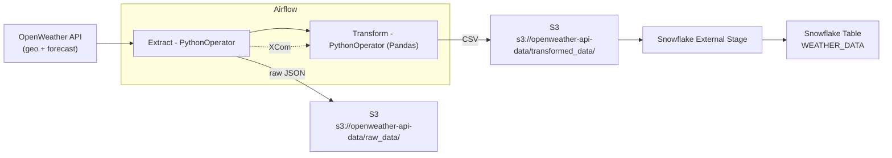

> Status: **WIP** — iterating as I learn and expand the pipeline.

## Weather → S3 → Snowflake (Airflow + Docker)

A small, production-flavored pipeline that fetches **OpenWeather** data for a city (default **Vilnius**), stores **raw JSON** and **clean CSV** in **S3**, then loads it into **Snowflake** via an external stage — all orchestrated by **Apache Airflow**.

---

## What this demonstrates

- **Airflow 2.9** DAG design: TaskGroups, PythonOperator, retries, daily schedule
- **AWS S3** as raw/clean data layers
- **Snowflake** load with `COPY INTO` from an external stage
- **Docker Compose** stack for local development (webserver, scheduler, Postgres metadata)

---

## Architecture



**File naming** (per run):  
- Raw: `raw_data/{{ data_interval_start | ds }}_{city}.json`  
- Transformed: `transformed_data/{{ data_interval_start | ds }}_{city}.csv`

---

## Stack

- **Apache Airflow 2.9.2** (LocalExecutor) + **Postgres 13** (Airflow metadata)  
- **AWS S3** bucket: `openweather-api-data`  
- **Snowflake**: external stage `openweather_transformed_stage` → table `weather_data`

---

## Production Infrastructure

**Cost-Optimized AWS EC2 Deployment** (~€15-20/month vs MWAA's €350+/month):

### 🚀 **Automated EC2 Management**
- **Lambda + EventBridge**: Scheduled start/stop (04:45-06:00 UTC daily)
- **Docker Containerization**: Full Airflow stack with volume mounts
- **DAG Schedule**: Runs at 05:00 UTC during EC2 uptime window

### 🔧 **Infrastructure Setup**
```bash
# EC2 instance runs Docker Compose stack
docker-compose up -d  # Postgres + Webserver + Scheduler
```

**Access Points:**
- **Airflow Web UI**: http://ec2-instance:8080 (admin/admin)
- **DAG**: `weather_monitor` - Daily execution with TaskGroups

### 📈 **Monitoring & Reliability**
- **Failure Notifications**: Slack integration via callback functions
- **Retry Logic**: 2 attempts with 3-minute delays
- **Data Validation**: Pydantic models with temperature range checks (-50°C to 60°C)
- **Error Handling**: Comprehensive AirflowException handling

---

## CI/CD & Quality Assurance

**Automated CI/CD Pipeline** with GitHub Actions:

### 🧪 **Testing Workflow**
- **Unit tests** with pytest for transformation logic
- **Automated test execution** on every push/PR
- **Coverage tracking** for test completeness

```bash
# Local testing
pytest airflow/tests/ -v
```

### 🔍 **Code Quality Workflow** 
- **Pylint analysis** with 9.0+ score requirement
- **Airflow-specific configuration** (.pylintrc)
- **Automated quality gates** preventing low-quality merges

### 🔒 **Security Scanning**
- **GitHub CodeQL** for vulnerability detection
- **Dependency security analysis**
- **Automated security reviews** on pull requests

### 📦 **Dependency Management**
- **Airflow constraints** for conflict-free installations
- **Version pinning** for production stability
- **Separated dev/runtime dependencies**

```bash
# Install with constraints
pip install -r airflow/requirements/requirements.txt
```

**Quality Gates:** All PRs require passing tests, code quality checks, and security scans before merge.

---

## Production Enhancement Roadmap

### ✅ **Infrastructure & Deployment - COMPLETED**
- **AWS EC2 + Docker**: Cost-effective cloud deployment 
- **Automated EC2 Management**: Lambda + EventBridge scheduling
- **Docker Containerization**: Full Airflow stack deployment
- **Infrastructure as Code**: Future Terraform/CloudFormation implementation

### ✅ **CI/CD Pipeline - PRODUCTION READY**
- **Automated Testing**: Unit tests with pytest + CI workflow
- **Code Quality**: Pylint with 9.0+ threshold 
- **Security Scanning**: GitHub CodeQL vulnerability detection
- **Dependency Management**: Airflow constraints for stability
- **Quality Gates**: All PRs require passing tests and security checks

### 🔄 **Observability & Reliability - IN PROGRESS**
- **CloudWatch Monitoring**: TODO - DAG/EC2 performance monitoring
- **Slack Notifications**: TODO - Configure failure callbacks
- **Continuous Deployment**: TODO - Auto-deploy from main branch to EC2
- **Data Quality**: Future Great Expectations integration

### 🚀 **Future Scalability & Performance**
- **Data Partitioning**: Efficient organization strategies
- **Resource Optimization**: Auto-scaling and cost optimization
- **Parallel Processing**: Spark integration for large datasets
- **Caching Strategies**: Redis/ElastiCache implementation

### 📊 **Data Visualization & Analytics**
- **Google Looker Studio**: Snowflake integration for dashboards
- **Weather Analytics**: Trends, forecast accuracy, data quality KPIs
- **Self-Service Analytics**: Stakeholder exploration capabilities

---